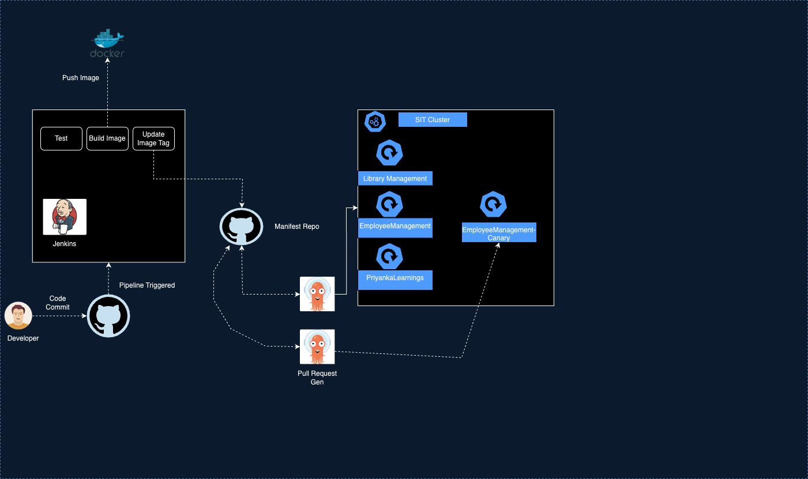
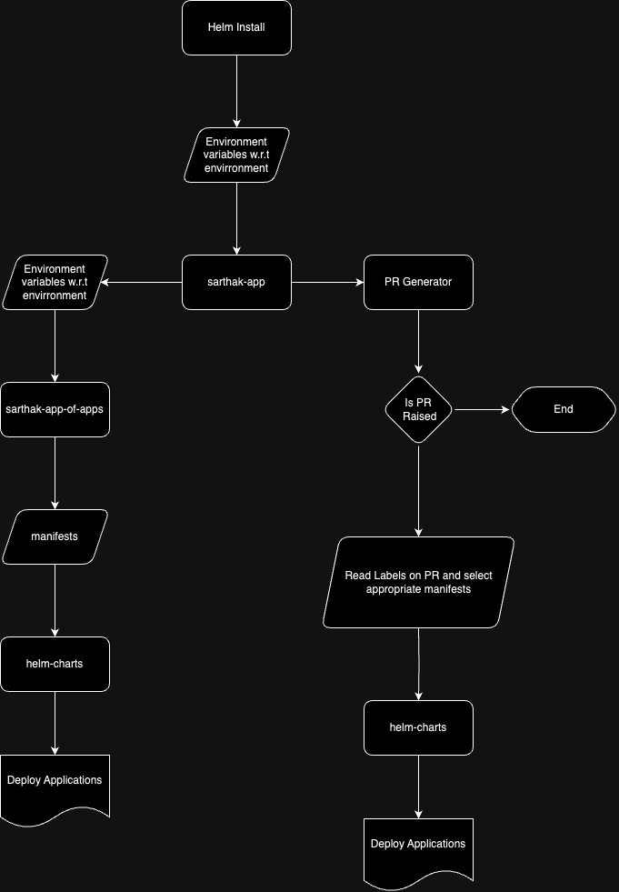
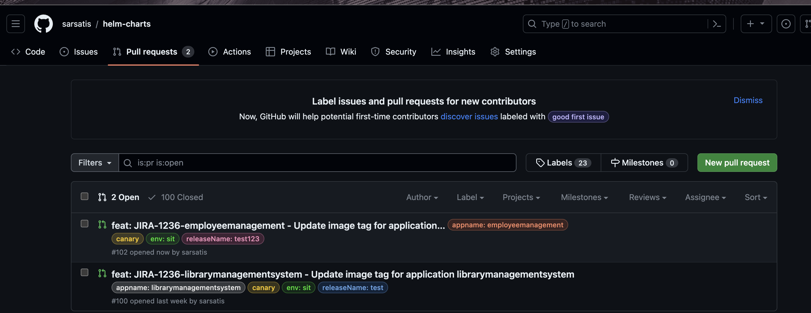
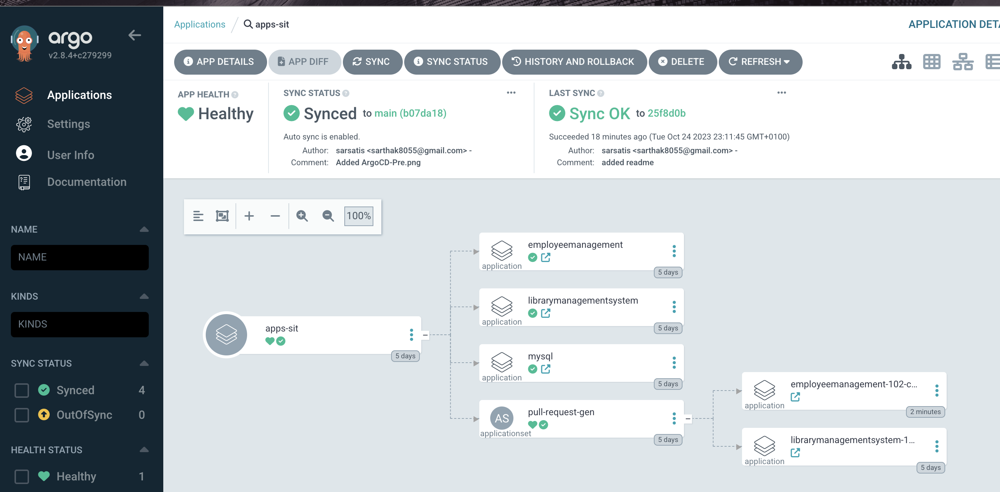
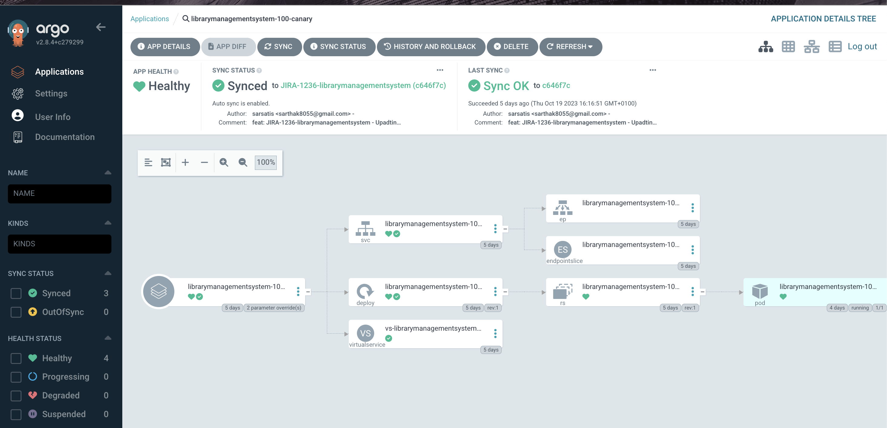
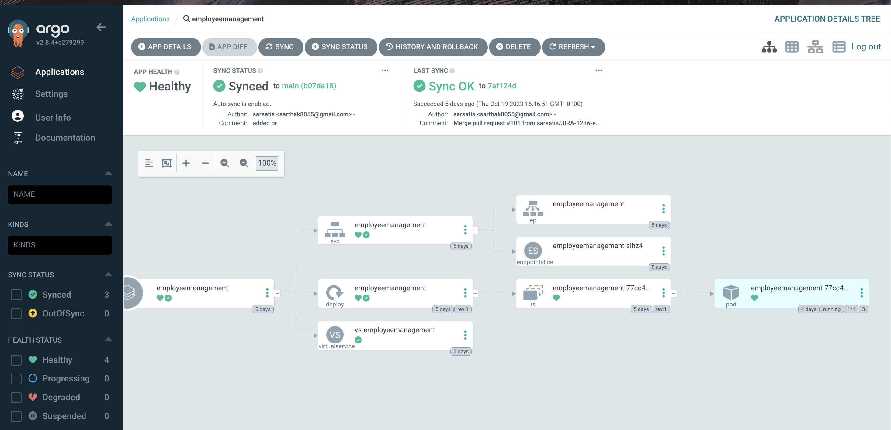

# Sarthak Application manifest Repository

## High Level Architecture Design


## Below is the application deployment journey depicted in flow chart




## Project Folder Structure and Control Flow

- We have leveraged apps-of-apps pattern provided by ArgoCD
- ArgoCD provides a Custom Resource Definition(CRD) called as **Application** which is used to manage microservice application
- We have used helm templating to manage our application deployments

### Breaking Down Folder Structure and its purpose

1. sarthak-app (Parent app managing all Children applications)
   - It follows helm templating approach
   - Inside templates folder we have a file called `apps.yaml` which is responsible for managing all the children application
   - We have environment specific values specified in respective `env-configs` folder for e.g `sit` folder for managing `sit` environment configurations and `pre` folder for managing `pre` environment
   - Sample yaml file after deploying it to `dev` environment 
   ```yaml
    project: default
    source:
    repoURL: 'https://github.com/sarsatis/helm-charts.git'
    path: sarthak-app-of-apps
    targetRevision: main
    helm:
        valueFiles:
        - env-configs/sit/values.yaml
    destination:
    server: 'https://kubernetes.default.svc'
    namespace: mfa
    syncPolicy:
    automated:
        prune: true
        selfHeal: true
    syncOptions:
        - CreateNamespace=true
   ```
   - Once the above template is deployed it finds the repository mentioned in `repoUrl` field and deploys the application manifests under the folder path mentioned in `path` field and its respective overriding values are fed from `valueFiles`
   
2. sarthak-app-of-apps
   - Inside templates folder we have a file `app.yaml` which is responsible for deloying individual microservice applications
   - We have use range operator capability provided by helm to iterate over application list specified under respective `env-configs` folder for e.g `sit` folder for managing `sit` environment configurations and `pre` folder for managing `pre` environment
   - sample yaml for one of the Application deployed e.g `employeemanagement`
    ```yaml
    apiVersion: argoproj.io/v1alpha1
    kind: Application
    metadata:
    finalizers:
        - resources-finalizer.argocd.argoproj.io
    labels:
        app.kubernetes.io/instance: apps-sit
    name: employeemanagement
    namespace: argocd
    spec:
    destination:
        namespace: mfa
        server: 'https://kubernetes.default.svc'
    project: default
    source:
        helm:
        valueFiles:
            - /manifests/employeemanagement/sit/immutable/values.yaml
            - /manifests/employeemanagement/sit/configmap/configmap.yaml
        path: helm-charts
        repoURL: 'https://github.com/sarsatis/helm-charts.git'
        targetRevision: main
    syncPolicy:
        automated:
        prune: true
        selfHeal: true
        syncOptions:
        - CreateNamespace=true
    ```
    - Once the above template is deployed it finds the repository mentioned in `repoUrl` field and deploys the application manifests under the folder path mentioned in `path` field and its respective overriding values are fed from `valuesFiles`
    - Application which needs to be deployed are controlled by `appList` which is maintained in respective environment config folder for e.g `env-configs/sit/values.yaml`
  
        - To deploy the application to cluster add the app name under `appList` in respective env folder
        ```yaml
        appList:
        - employeemanagement
        - librarymanagementsystem
        ```
        - To delete the application from the cluster comment the app name under `appList`
        ```yaml
        appList:
        # - employeemanagement
        - librarymanagementsystem
        ```
3. helm-charts
   - This section is further divided into 4 sections to manage kubernetes resources of respective application
     - api :- Deployment manifests are managed from this folder
     - configuration :- ConfigMap objects are managed
     - istio :- Virtual service components are managed 
     - service :- service object are managed for communication between microservice applications and routing traffic from external sources

4. manifests
   - Environment specific values for microservice application are provided

5. PR Generator
   - To have Blue Green implementation of a microservice we have used Pull Request Generator of ArgoCD
     - Below is the yaml spec
    ```yaml
    apiVersion: argoproj.io/v1alpha1
    kind: ApplicationSet
    metadata:
    labels:
        app.kubernetes.io/instance: apps-sit
    name: pull-request-gen
    namespace: argocd
    spec:
    generators:
        - pullRequest:
            github:
            labels:
                - canary
            owner: sarsatis
            repo: helm-charts
            tokenRef:
                key: token
                secretName: github-token
            requeueAfterSeconds: 15
    goTemplate: true
    template:
        metadata:
        name: '>-
            {{ index (sortAlpha .labels) 0 | replace "appname: " ""}}-{{ .number
            }}-canary'
        spec:
        destination:
            namespace: mfa
            server: 'https://kubernetes.default.svc'
        project: default
        source:
            helm:
            parameters:
                - name: jiraId
                value: '{{ index (sortAlpha .labels) 3 | replace "releaseName: " ""}}'
                - name: canary
                value: 'True'
            valueFiles:
                - '>-
                /manifests/{{ index (sortAlpha .labels) 0 | replace "appname: " ""
                }}/{{ index (sortAlpha .labels) 2 | replace "env: "
                ""}}/immutable/values.yaml'
                - '>-
                /manifests/{{ index (sortAlpha .labels) 0 | replace "appname: " ""
                }}/{{ index (sortAlpha .labels) 2 | replace "env: "
                ""}}/configmap/configmap.yaml'
            path: helm-charts
            repoURL: 'https://github.com/sarsatis/helm-charts.git'
            targetRevision: '{{ .branch }}'
        syncPolicy:
            automated:
            prune: true
            selfHeal: true
            syncOptions:
            - CreateNamespace=true

    ```
     - In the generator section repository is configured where pull requests need to be detected and deployed
     - Pull requests labelled `canary` will be detected and deployed into cluster
     - A github-token secret is create into cluster to enable communication from cluster to github repository.
     - PR will be labelled with `appname`, `env` to which it has to be deployed, `releaseName` of the feature which is being developed and `canary` tag to identify from other PR
     - Once the PR is labelled Pull Request generator uses this labels to create canary version of the application dynamically and deploy's it to cluster. (Python script is responsible for creation of Pull Request and adding labels. Pull request creation is part of `Jenkinsfile`)
     - Sample PR with labels added
       
     - Sample applications deployed from above PR
       
     - Canary App Deployed using Pull Request Generator
       
     
## Snapshot of apps-of-app pattern used


## Snapshot of microservice deployed using apps-of-app pattern



## To install sarthak apps into respective environment use the below command

```go
helm install sarthak-apps sarthak-app/ -f sarthak-app/env-configs/<env>/values.yaml

e.g
helm install sarthak-apps sarthak-app/ -f sarthak-app/env-configs/pre/values.yaml
```

> env :- `sit` or `pre`


## Problems and issues faced with this approach
1. common helm template issue
2. Image propagation from one env to another env
3. Argo some times gets stuck while getting deletion we have to delete the finilizers manually and the apps gets deleted
4. Sync status if there is something wrong in yaml it keeps syncing new changes are not picked immediately until we stop the sync manually
5.We use helm install manually to bring up all apps whats the best way to automate it
   
   
        
   
   


